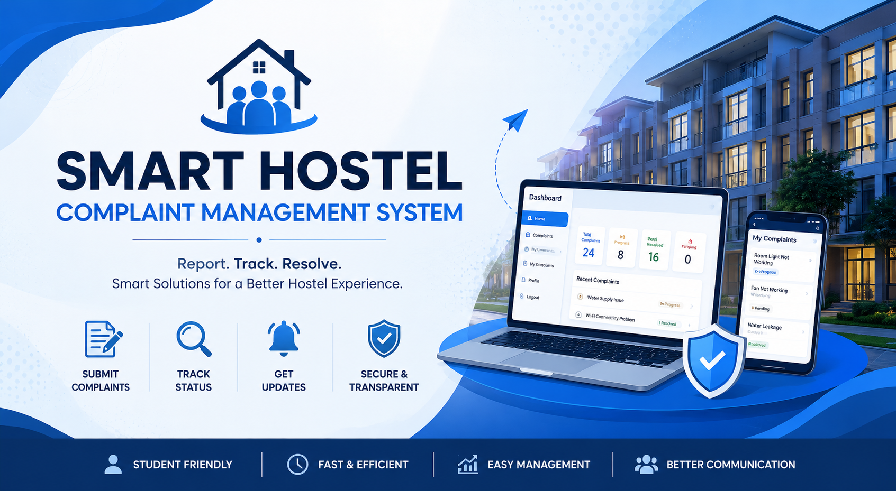
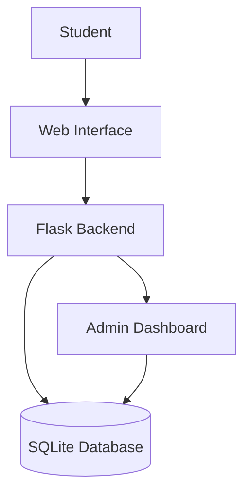
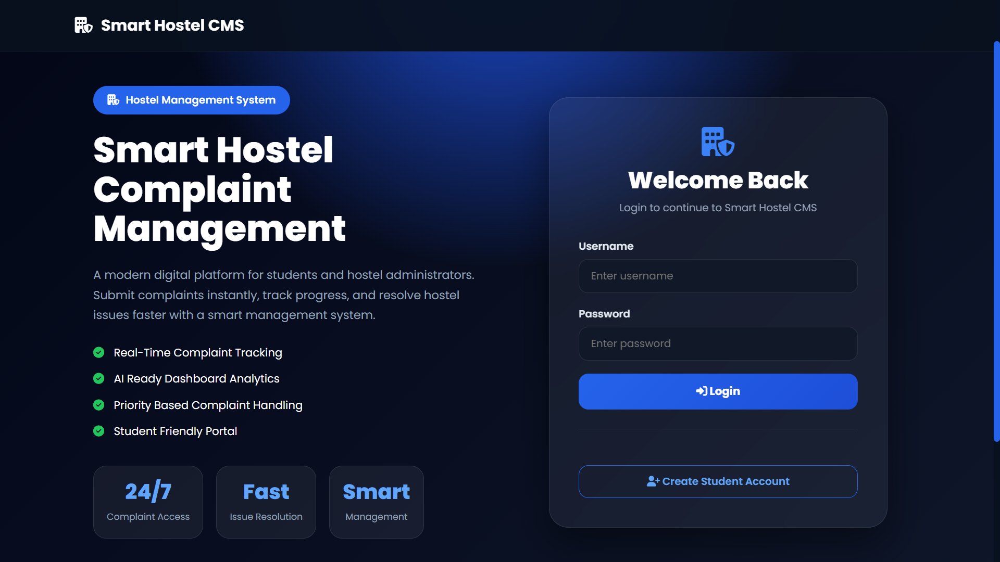
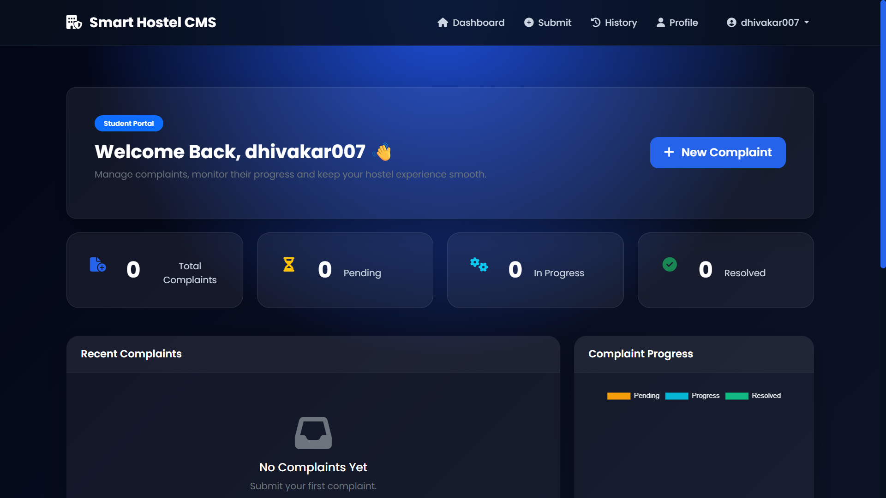
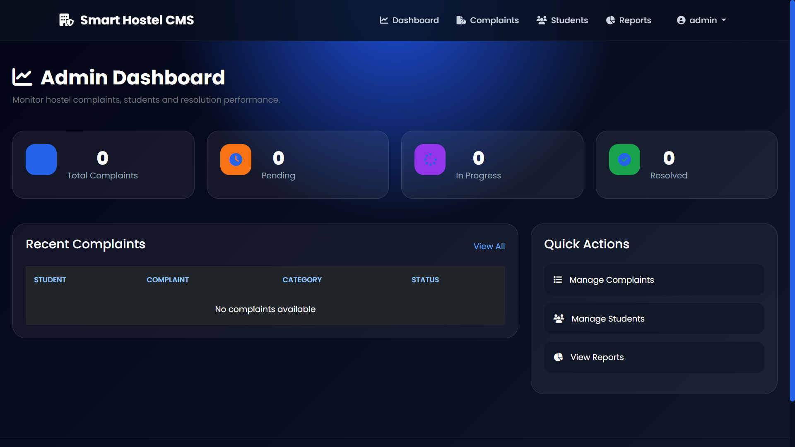

# 🏠 Smart Hostel Complaint Management System

<p align="center">
  <b>A Web-Based Hostel Complaint Management Platform</b><br>
  Digitalizing hostel issue reporting, tracking, and resolution management.
</p>

<p align="center">
  
  
  
  
</p>

---
## 📑 Table of Contents

- Project Overview
- Project Highlights
- Key Features
- Technology Stack
- Project Structure
- System Architecture
- Installation
- Live Demo
- Application Preview
- Security Features
- Future Enhancements
- AI-Assisted Development
- Contact
- Acknowledgements
- License

---

## 📌 Project Overview

The **Smart Hostel Complaint Management System** is a web-based application designed to simplify and automate the hostel complaint handling process.

The system allows students to submit complaints digitally, track complaint progress, and receive updates, while administrators can manage complaints efficiently through a centralized dashboard.

The main objective of this project is to reduce manual complaint handling, improve communication between students and hostel management, and provide a transparent issue-resolution system.

## 🎯 Project Highlights

- Responsive web-based complaint management system
- Separate Student and Administrator portals
- Secure authentication and session management
- Complaint lifecycle tracking
- Clean and intuitive dashboard
- Hosted online using Render
- Developed using modern Python Flask architecture

---

# ✨ Key Features

## 👨‍🎓 Student Module

* Student registration and login
* Submit hostel complaints
* Select complaint categories
* Track complaint status
* View complaint history
* Receive updates on complaint progress

## 👨‍💼 Admin Module

* Secure admin login
* Dashboard overview
* View all complaints
* Update complaint status
* Manage student complaints
* Monitor issue resolution progress

---

# 🛠️ Technology Stack

| Category               | Technology                    |
| ---------------------- | ----------------------------- |
| Frontend               | HTML, CSS, JavaScript         |
| Backend                | Python Flask                  |
| Database               | SQLite                        |
| Version Control        | Git & GitHub                  |
| Deployment             | Render                        |
| Development Assistance | AI-assisted development tools |

---

## 📂 Project Structure

```text
smart-hostel-complaint-management-system/

├── app.py
├── requirements.txt
├── database.db
├── static/
├── templates/
├── docs/
├── assets/
├── README.md
└── LICENSE
```

---

## 🏗️ System Architecture



---

# 🚀 Installation & Setup

### 1. Clone Repository

```bash
git clone https://github.com/dhivakar007-ai/smart-hostel-complaint-management-system.git
```

### 2. Navigate to Project Folder

```bash
cd smart-hostel-complaint-management-system
```

### 3. Create Virtual Environment

```bash
python -m venv .venv
```

### 4. Activate Environment

Windows:

```bash
.venv\Scripts\activate
```

### 5. Install Dependencies

```bash
pip install -r requirements.txt
```

### 6. Run Application

```bash
python app.py
```

Open:

```
http://127.0.0.1:5000
```

---

## 🌐 Live Demo

The application is deployed on **Render** and is publicly accessible.

<p align="center">

**Live Website:**  
https://smart-hostel-complaint-management-system-evzo.onrender.com/

## 📸 Application Preview

<p align="center">
  
</p>

<p align="center"><b>Login Page</b></p>

---

<p align="center">
  
</p>

<p align="center"><b>Student Dashboard</b></p>

---

<p align="center">
  
</p>

<p align="center"><b>Admin Dashboard</b></p>
---

# 🔒 Security Features

* Password-based authentication
* Protected user sessions
* Input validation
* Role-based access control

---

# 📈 Future Enhancements

* Email notifications
* Mobile application support
* AI-based complaint classification
* Analytics dashboard
* Automatic complaint priority detection

---

## 🤖 AI-Assisted Development

This project was developed using **AI-assisted software development practices**.

Artificial Intelligence tools were used as engineering assistants to:

- Accelerate debugging and troubleshooting
- Improve code readability and maintainability
- Refine UI/UX design ideas
- Assist with documentation
- Explore implementation approaches and best practices

All architectural decisions, feature integration, testing, deployment, and final validation were completed as part of the project development process.

AI was used as a productivity aid, similar to consulting official documentation, technical references, and developer resources.

---

## 📬 Contact

**Developer:** Dhivakar S

GitHub: https://github.com/dhivakar007-ai

For academic discussions or project-related queries, feel free to open an issue in this repository.
---

# ⭐ Acknowledgements

Special thanks to:

* Flask Documentation
* Python Community
* Open-source contributors
* AI-assisted development tools for improving productivity and problem-solving efficiency

---

## 📄 License

This project is developed for academic and educational purposes.

© 2026 Dhivakar. All rights reserved.

---

<p align="center">
⭐ If you find this project useful, consider giving it a star!
</p>
